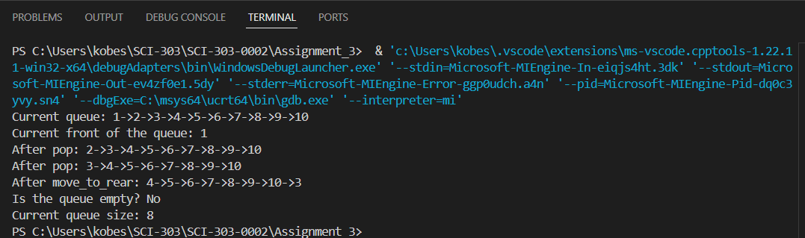
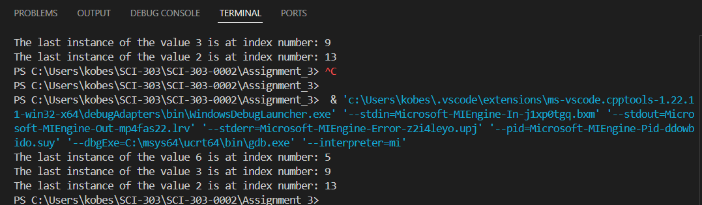
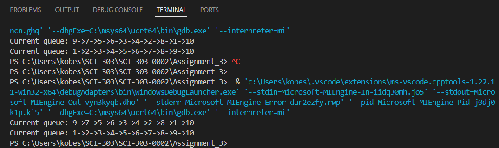

A3_Q1:
This program is a queue with the following functionality:
1. Add a vaule to the back of the queue
2. Display the front or whether the list is empty
3. Move the front value to the end of the queue
This program is just preset data and will always give the same outputs

A3_Q2:
This Program searchs a vector of integers for the last instance of a value
This program is just preset data and will always give the same outputs

A3_Q3:
This Program puts a queue of integers through a insertion sort function by converting the queue into a vector 
sorting the values, then putting them back into the queue
This program is just preset data and will always give the same outputs
